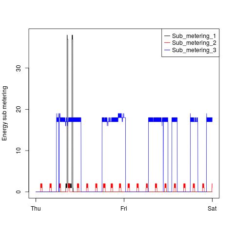
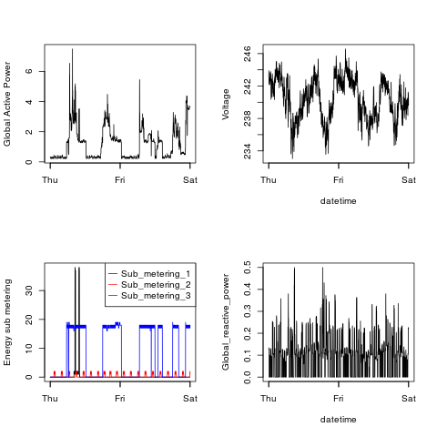

## Introduction

This is a forked repository of https://github.com/rdpeng/ExData_Plotting1. Please read the intorduction of the that repository.

The scripts in the repository works with a prefitered set of data, so before running the R script, please run the provided shell script via

    sh household-filter.sh

or

    chmod +x household-filter.sh
    ./household-filter.sh

This script downloads the zipped data file, extracts it, and filters the appropriate lines (header and records created on the specific dates) with grep into the file `household_power_consumption.csv`.

### Plot 1

 

### Plot 2

 

### Plot 3

 

### Plot 4

 

